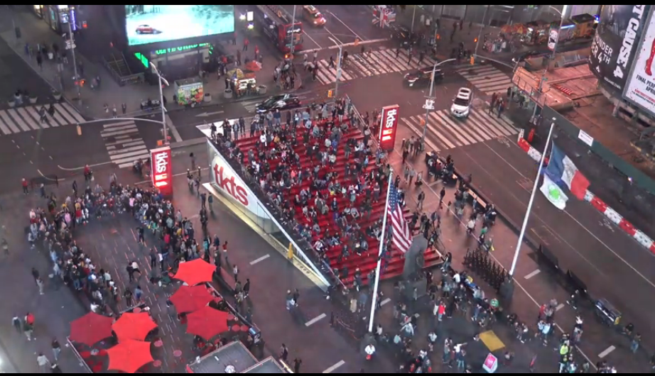

## MMM-TimesSquare-Live

* Live stream from Times Square, New York City, NY USA.

In Times Square (Midtown Manhattan, New York) there is this live HD cam showing you the crowd of locals and tourists, and the occasional queue to a Broadway play. Times Square is a significant commercial intersection and a must-go place for tourists in New York, attracting an estimated 50 millions each year. With its bright colourful billboards, which are its most memorable feature, Times Square has been featured in many, many films and TV series.

## Examples
The module is a live stream. These are still shots, obviously. The cam rotates through many views.

## Installation

* `git clone https://github.com/mykle1/MMM-TimesSquare-Live` into the `~/MagicMirror/modules` directory.

## Config.js entry and options

    {
    disabled: f,
    module: 'MMM-TimesSquare-Live',
    position: 'top right',
    config: {
        height:"270px",
        width:"480px",
        useHeader: false,                // true if you want a header
        header: "",                      // Change in config file. useHeader must be true
        animationSpeed: 1000,            // fade speed
    }
},
